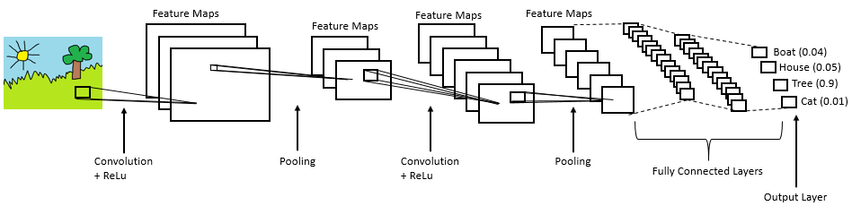

# This Documenation serves to explain the process of my Classification using CNN on the GTSRB Dataset.

## The Goal:

In a Nutshell: Given are pictures of traffic signs. Basically I want the computer to recognize which traffic sign is shown in the picture.

## Process: 

1. **Understanding the Dataset**: First, I explored the GTSRB dataset to understand its structure, the number of classes, and the distribution of images across these classes.


    The 64 x 64 images are actually a grid of numbers. [[255, 0, 0], [255, 0, 0], ...] would just be a red row of pixels. For our purposes I will normalize these values for one simple reason. Math works better on smaller numbers and we are trying to optimize this model. [[1.0 , 0.0, 0.0], [1.0 , 0.0, 0.0], ...] will then be the output for example.

2. **Application of CNN**: As for my model I used a Convoluted Neural Network (CNN). Think of it like an assembly line, where each image goes through the stations and in the end an answer is generated.


    
    *Figure: Example visualization of CNN (not specific to my project)*

    
    *Layer 1: Convolution (Finding the simple patterns)*             

    In this first layer our model simply applies filters (in the form of matrices) to look for specific patterns. Through this we can find patterns like triangles in danger signs or yield. Of course all of this happens in a more complex way but this is the basic idea of it.


    *Layer 2: Batch Normalization (Keeping Things Stable)*                          

    After finding patterns, the numbers can get messy - some too big, some too small. Batch normalization is like a quality control checkpoint that standardizes everything to a similar range. This keeps the training stable and helps the model learn faster without getting confused by wildly different number scales.           


    *Layer 3: Max Pooling (Shrinking Down)*                          

    Now we need to focus on what matters. Max pooling takes a small grid (like 2×2 pixels) and keeps only the strongest signal - the maximum value. This shrinks the image (64×64 → 32×32 → 16×16) while keeping the important features. It's like zooming out on a map - you lose small details but keep the main landmarks.


    *Layer 4: Dropout (Preventing Cheating)*                 

    Dropout randomly "turns off" some neurons during training (like 25% of them). Why? To prevent the model from memorizing specific training images instead of learning general patterns. It forces the network to learn multiple ways to recognize a sign, making it more robust. Think of it like studying with random pages missing - you learn concepts, not just memorize answers.


    *Layer 5: Building Deeper (Multiple Blocks)*                   

    We repeat these steps (Convolution → Batch Norm → Pooling → Dropout) three times, each time:

        - Using more filters (32 → 64 → 128 → 256) to detect more complex patterns
        - Making the image smaller (32×32 → 16×16 → 8×8)
        - Learning higher-level concepts (edges → shapes → objects → specific signs)


    *Layer 6: Global Average Pooling (Final Compression)*                                

    At the end we have 256 feature maps (8×8 grids). Instead of flattening everything into thousands of numbers, we take the average of each map. This gives us 256 summary values - one for each feature like "red circle detected", "triangle present", "number 3 shape", etc. Much cleaner and faster than the old flatten approach.


    *Layer 7: Dense Layers (Making the Decision)*                 

    Now the dense (fully connected) layers act like a voting committee:

        - First dense layer (512 neurons): Combines features - "red circle + white center + digits = speed limit sign"
        - Second dense layer (256 neurons): Refines it - "curved digits + specific pattern = it's a 30"
        - Output layer (43 neurons): Final vote - gives probability for each of the 43 sign types

    The highest probability wins - that's our prediction!


### Results from train_gtsrb_v1:

The Model only achieved an accuracy of 9%, stopping after 22 epochs due to early stopping.

Something is wrong with the model and a second version will be created to fix the issues.

#### Analysing what was wrong

1. The ImageDataGenerator.flow() had critical issues:

    - Created augmentations on the CPU (slow, creating a bottleneck)
    - Generator state management broke when combined with class weights
    - Randomly exhausted data mid-epoch, causing incomplete training cycles
    - Model never saw all training data consistently

2. Inefficient Architecture

    The first model used Flatten() after the convolution layers:
    ```Code 
    8×8×256 features → Flatten() → 4,096 numbers → Dense(512)

    This single connection required 2.1 million parameters - too many for a dataset of 39,000 images. The model was too complex, slow to train, and prone to overfitting.
3. Excessive Regularization

    Heavy dropout (0.3-0.5) was applied after every layer. While dropout prevents overfitting, too much prevents the model from learning patterns in the first place - especially when combined with inconsistent data flow.

#### What Changed in Version 2

1. Modern Data Pipeline
```Python
# New approach
augmentation = keras.Sequential([
    layers. RandomRotation(0.1),
    layers.RandomTranslation(0.1, 0.1),
    layers.RandomZoom(0.1),
    layers.RandomContrast(0.2),
])

augmented_model = keras. Sequential([augmentation, cnn_model])
augmented_model.fit(X_train, y_train, batch_size=128, ...)
```

*Key improvements:*

    - Augmentation as model layers: Runs on GPU during training, not as separate preprocessing
    - No generators: Direct array input eliminates state management bugs
    - Consistent data flow: Every epoch sees all 31,367 training images
    - Larger batches: Increased from 64 to 128 for faster, more stable training

2. Optimized Architecture

    Replaced Flatten() with GlobalAveragePooling2D():
    ```Code
    8×8×256 features → GlobalAvgPool → 256 numbers → Dense(512)
    
    This reduced the bottleneck from 2.1M parameters to just 131K parameters (16× reduction). The model became:

        - Faster to train (fewer weights to update)
        - Less prone to overfitting
        - Better at generalizing to new images
3. Strategic Regularization

    Instead of heavy dropout everywhere, I applied it strategically:

        - Light dropout (0.25) after convolution layers - preserve spatial features
        - Heavy dropout (0.4-0.5) only in dense layers - prevent memorization where it matters
#### Results
Results are documented thoroughly in the Results.md file in this project.

#### Key Takeaway:

The first model failed not because the concept was wrong, but because of implementation issues - specifically the buggy data generator and inefficient architecture. By switching to modern Keras augmentation layers and optimizing the bottleneck with Global Average Pooling, Version 2 trains consistently and learns properly. The improvement from 9% to 85%+ accuracy demonstrates the importance of not just what your model does, but how it processes data.