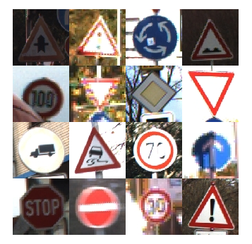

# 🚦 Traffic Sign Recognition with Deep Learning

### Classifying 43 types of German traffic signs using Convolutional Neural Networks

**[Documentation](Documentation.md)** • **[Results](Results%20v2.md)** • **[Model Architecture](#model-architecture)**

---

## Overview

A deep learning project that classifies 43 types of German traffic signs using Convolutional Neural Networks (CNN), achieving **97.38% test accuracy** on the GTSRB dataset ("bad" results are explained below).

**Key Results:**
- **Test Accuracy**: 97.38%
- **Validation Accuracy**: 99.76%
- **Dataset**: 31,367 training images, 12,630 test images
- **Classes**: 43 different traffic sign types

---

## The Dataset

The [German Traffic Sign Recognition Benchmark (GTSRB)](https://benchmark.ini.rub.de/gtsrb_dataset. html) contains over 50,000 images of traffic signs across 43 classes:

- Speed limits (20, 30, 50, 60, 70, 80, 100, 120 km/h)
- Danger signs (curves, pedestrians, animals, etc.)
- Mandatory signs (turn directions, roundabouts)
- Prohibitory signs (no entry, no passing, etc.)

Images are 64×64 pixels with varying lighting conditions, angles, and quality - simulating real-world scenarios. 

---

## Model Architecture

The CNN uses a modern architecture optimized for image classification:
| Layer | Description |
|-------|-------------|
| **Input** | 64×64×3 RGB image |
| ↓ | |
| **Augmentation** | Random rotation, translation, zoom, contrast |
| ↓ | |
| **Conv Block 1** | Conv2D (32 filters) → BatchNorm → MaxPool → Dropout (0.25) |
| ↓ | |
| **Conv Block 2** | Conv2D (64 filters) → BatchNorm → MaxPool → Dropout (0.25) |
| ↓ | |
| **Conv Block 3** | Conv2D (128 filters) → BatchNorm → MaxPool → Dropout (0.25) |
| ↓ | |
| **Conv Block 4** | Conv2D (256 filters) → BatchNorm → MaxPool → Dropout (0.25) |
| ↓ | |
| **Pooling** | GlobalAveragePooling2D (8×8×256 → 256 features) |
| ↓ | |
| **Dense 1** | 512 neurons → Dropout (0.5) |
| ↓ | |
| **Dense 2** | 256 neurons → Dropout (0.5) |
| ↓ | |
| **Output** | 43 classes with softmax activation |

**Key Features:**
- **Data Augmentation**: Built-in random transformations prevent overfitting
- **Batch Normalization**: Stabilizes training and speeds up convergence
- **Global Average Pooling**: Reduces parameters from 2.1M → 131K (16× reduction)
- **Strategic Dropout**: Light dropout (0.25) in conv layers, heavy (0.5) in dense layers
- **Class Weighting**:  Handles dataset imbalance (10.7× ratio between most/least common classes)

**Total Parameters**:  2,846,027

---

## Training Process

The model was trained with:
- **Optimizer**: Adam (learning rate: 0.001)
- **Batch Size**: 128
- **Epochs**: 72 (with early stopping)
- **Callbacks**: 
  - Early stopping (patience: 15 epochs)
  - Learning rate reduction on plateau
  - Model checkpoint (saves best weights)

**Training took ~5 hours** on CPU (4.3 min/epoch).

---

## Results

### Overall Performance

| Metric | Value |
|--------|-------|
| Test Accuracy | **97.38%** |
| Test Loss | 0.1123 |
| Validation Accuracy | 99.76% |
| Training Accuracy | 98.47% |

### Per-Class Performance

**Best Classes**:  Most classes achieve near-perfect accuracy (>98%)

**Challenging Classes**:
- **Class 21** (Double curve): 68% - confused with similar danger signs
- **Class 6** (End of 80km/h limit): 85% - confused with regular 80km/h sign (only differs in colors)

## What Went Wrong (Version 1)

The first version achieved only **9% accuracy** and failed after 22 epochs. Issues included:

1. **Broken Data Pipeline**: `ImageDataGenerator.flow()` caused data interruptions mid-epoch
2. **Inefficient Architecture**: Using `Flatten()` created a 2.1M parameter bottleneck
3. **Over-Regularization**: Excessive dropout prevented learning

### How It Was Fixed

| Issue | Solution | Impact |
|-------|----------|--------|
| Data interruptions | Switched to `keras.Sequential` augmentation layers | Consistent training |
| 2.1M parameter bottleneck | Replaced `Flatten()` with `GlobalAveragePooling2D` | 16× parameter reduction |
| Over-regularization | Strategic dropout (light in conv, heavy in dense) | Better learning |

**Result**: Accuracy improved from **9% → 97.38%** (10.8× increase).

---

## Project Structure

<pre>
Traffic-Sign-Classification/
│
├── src/
│   ├── train_gtsrb.py              # Training script
│   └── test_model.py               # Testing and evaluation script
│
├── <b>output_images/</b>
│   ├── training_history.png        # Training curves
│   ├── confusion_matrix_test.png   # Confusion matrix heatmap
│   ├── per_class_accuracy.png      # Per-class performance
│   └── sample_predictions.png      # Sample predictions visualization
│
├── best_model.keras                # Trained model weights
├── test_results.csv                # Detailed prediction results
├── Documentation.md                # Technical documentation
├── Results v2.md                   # Detailed results analysis
└── README.md                       # This file
</pre>

---

## Requirements
tensorflow>=2.13.0             
opencv-python>=4.8.0            
pandas>=2.0.0              
matplotlib>=3.7.0              
seaborn>=0.12.0             
scikit-learn>=1.3.0               
numpy>=1.24.0            

## Key Takeaways

- Data pipeline matters: A broken generator caused 9% accuracy; fixing it enabled proper learning
- Architecture efficiency: GlobalAveragePooling reduced parameters by 16× without losing accuracy
- Strategic regularization: Dropout placement is more important than amount
- Class imbalance: Weighting classes (10.7× ratio) improved minority class performance

The model demonstrates that careful attention to implementation details - not just architecture design - is critical for deep learning success.
## Future Improvements

- Transfer learning: Fine-tune pre-trained models (ResNet, EfficientNet) for better feature extraction
- Real-world testing: Evaluate on dashcam footage with weather effects (rain, fog, snow)
- Model compression: Quantize for deployment on edge devices (Raspberry Pi, mobile)
- Multi-country support: Extend to traffic signs from other countries

## Dataset Attribution

This project uses the German Traffic Sign Recognition Benchmark (GTSRB) dataset:

    J. Stallkamp, M. Schlipsing, J. Salmen, C. Igel. The German Traffic Sign Recognition Benchmark: A multi-class classification competition. IEEE International Joint Conference on Neural Networks, 2011.

Dataset available at: https://benchmark.ini.rub.de/gtsrb_dataset.html
## License

This project is available under the MIT License. The GTSRB dataset has its own terms of use.

Made by @josua8-dev

 
