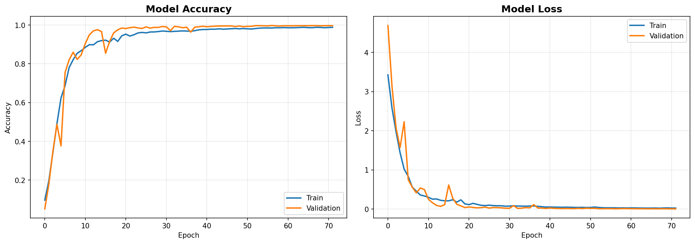
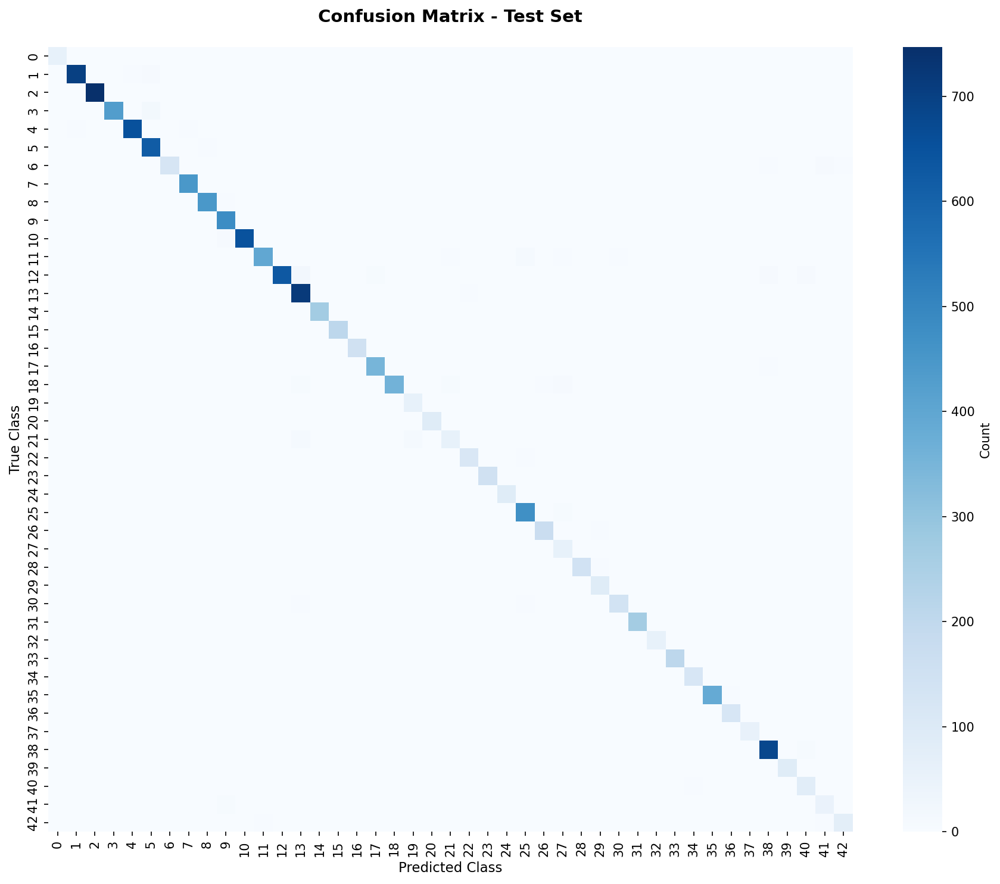
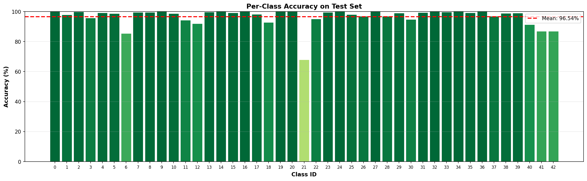
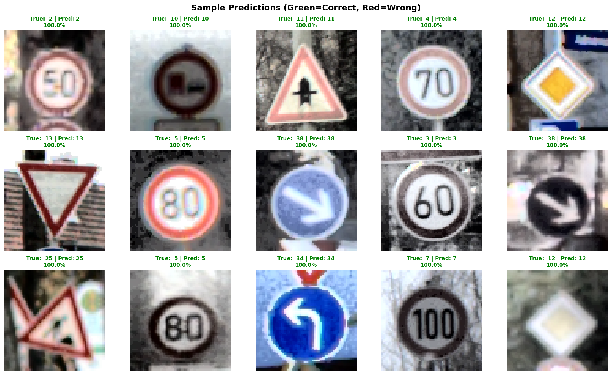

# Results

## Training Performance

The model was trained for **22 epochs** with the following configuration:
- **Architecture**:  Convolutional Neural Network (CNN)
- **Optimizer**: Adam (initial learning rate: 0.001)
- **Batch Size**: 128
- **Data Augmentation**: Random rotation, translation, zoom, and contrast adjustment
- **Class Weighting**: Applied to handle dataset imbalance (10. 7× ratio)

#### Training Metrics

- **Final Training Accuracy**: 98.47% (Epoch 57)
- **Final Validation Accuracy**: 99.76%
- **Training Time**: ~ 4.3 minutes per epoch (19:18 - 00:21)
- **Total Parameters**: 2,846,027 (2.84M)

*Figure 1: Training and validation accuracy/loss over 72 epochs*

---

## Test Set Evaluation

The trained model was evaluated on a separate test set that was not seen during training.       
*Split Train Data - 80% Train & 20% Validation*

### Overall Performance

- **Test Accuracy**:  97.38%
- **Test Loss**: 0.1123 - 1.123%
- **Total Test Samples**: 12630 images

### Confusion Matrix

*Figure 2: Confusion matrix showing prediction patterns across all 43 classes*

The confusion matrix reveals:
- **Strong diagonal**:  predictions seem to be nearly perfect (clear diagonal)
- **Common confusions**: not found? 

---

## Per-Class Analysis

*Figure 3: accuracy breakdown for each of the 43 traffic sign classes*

### Best Performing Classes
- **Classes**:  Many are at nearly at a perfect 100%

### Challenging Classes
- **Class 6 (End of speed limit (80km/h))**: about 85% Accuracy -> fairly low. Might be because of the similarity to the Speed Limit (80km/h) and the only difference being the color
- **Class 21 (Dangerous curve to the right)**: about 68% Accuracy -> lowest overall by far. Might be mistaken with similar danger signs.

**Observations**:
- Classes with more training samples generally perform better
- Similar-looking signs (e.g., speed limit 80 and the End Sign corresponding to it and Dangerous curve to the right) show some confusion, as they are among the few not well predicted signs.
- These few outliers drag down the overall accuracy immensely, while it is still able to end up at 97.38% in spite of that.
---

## Sample Predictions

*Figure 4: Random sample of test predictions*

---

## Key Findings

**High Overall Accuracy**: Model is mostly correct with all of the signs, except a very few outliers. Still, with some adjustments in mind, these results are promising

---

## Comparison to Baseline

| Metric | Version 1 (Failed) | Version 2 (Final) | Improvement |
|--------|-------------------|------------------|-------------|
| **Training Pipeline** | Broken (data interruptions) | Reliable (consistent epochs) |  Fixed |
| **Final Accuracy** | 9.0% (stuck) | 99.76% training / 97.38% test | **<1000% increase** |
| **Training Stability** | Inconsistent | Consistent |  All Around |
| **Architecture** | Inefficient (2.1M bottleneck) | Optimized (131K bottleneck) | **16× reduction** |

---

## Limitations and Future Work

**Current Limitations**:
- Model trained only on GTSRB dataset (German traffic signs)
- Performance may degrade on signs from other countries
- Real-world conditions (weather, occlusions, damage) not fully represented

**Future Improvements**:
1. **Data Augmentation**: Add weather effects (rain, fog, snow simulation)
2. **Transfer Learning**: Fine-tune on pre-trained models (ResNet, EfficientNet) for better feature extraction
3. **Real-World Testing**: Evaluate on dashcam footage or live camera feeds
4. **Multi-Task Learning**: Simultaneously predict sign type and bounding box location
5. **Model Compression**: Quantization for deployment on edge devices (Raspberry Pi, mobile)

---

## Conclusion

The final CNN model successfully classifies 43 types of German traffic signs with **97.38% test accuracy** in training, a significant improvement from the initial 9% baseline. Key factors in this success were: 
- Fixing the data pipeline
- Optimizing architecture (GlobalAveragePooling)
- Proper regularization strategy (strategic dropout)
- Class weighting to handle imbalanced data

While there can still be more improvements made, which should severely improve our model, it demonstrates strong potential for real-world traffic sign recognition applications. 